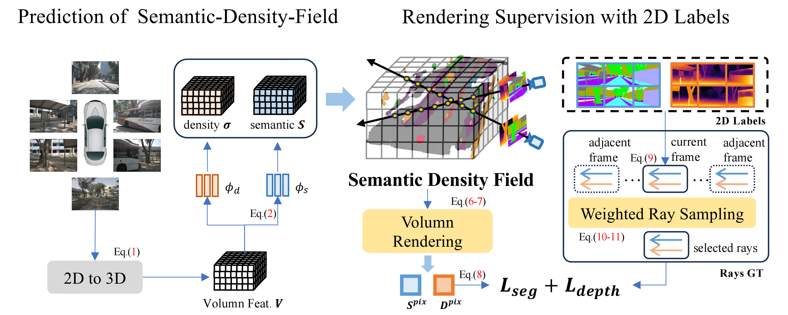

# RenderOcc

### [paper](https://arxiv.org/abs/2309.09502) | [video](https://www.youtube.com/watch?v=UcdXM3FNLAc)


(Visualization of RenderOcc's prediction, which is supervised only with 2D labels.)

## INTRODUCTION

**RenderOcc** is a novel paradigm for training vision-centric 3D occupancy models **only with 2D labels**. Specifically, we extract a NeRF-style 3D volume representation from multi-view images, and employ volume rendering techniques to establish 2D renderings, thus enabling direct 3D supervision from 2D semantics and depth labels. 



## Getting Started

- [Installation](docs/install.md)

- [Prepare Dataset](docs/prepare_datasets.md)

- Train 
  
  ```
  # Train RenderOcc with 8 GPUs
  ./tools/dist_train.sh ./configs/renderocc/renderocc-7frame.py 8
  ```

- Evaluation 
  
  ```
  # Eval RenderOcc with 8 GPUs
  ./tools/dist_test.sh ./configs/renderocc/renderocc-7frame.py ./path/to/ckpts.pth 8
  ```

- Visualization
  
  ```
  # TODO
  ```

## Model Zoo

| Method    | Backbone  | 2D-to-3D  | Lr Schd | GT | mIoU  | Config                                          | Download                                                                                    |
|:---------:|:---------:|:---------:|:-------:|:-------:|:-----:|:-----------------------------------------------:|:-------------------------------------------------------------------------------------------:|
| RenderOcc | Swin-Base | BEVStereo | 12ep    | 2D | 24.46 | [config](configs/renderocc/renderocc-7frame.py) | [model](https://github.com/pmj110119/storage/releases/download/v1/renderocc-7frame-12e.pth) |

* More model weights will be released later.

## Acknowledgement

Many thanks to these excellent open source projects:

- [BEVDet](https://github.com/HuangJunJie2017/BEVDet), [DVGO](https://github.com/sunset1995/DirectVoxGO), [Occ3D](https://github.com/Tsinghua-MARS-Lab/Occ3D), [SurroundDepth](https://github.com/JeffWang987/OpenOccupancy), [OpenOccupancy](https://github.com/JeffWang987/OpenOccupancy), [CVPR2023-Occ-Challenge](https://github.com/CVPR2023-3D-Occupancy-Prediction)

Related Projects:

- [SurroundOcc](https://github.com/weiyithu/SurroundOcc), [TPVFormer](https://github.com/wzzheng/TPVFormer), [BEVFormer](https://github.com/fundamentalvision/BEVFormer), [VoxFormer](https://github.com/NVlabs/VoxFormer), [FB-Occ](https://github.com/NVlabs/FB-BEV), [SimpleOccupancy](https://github.com/GANWANSHUI/SimpleOccupancy), [OVO](https://github.com/dzcgaara/OVO-Open-Vocabulary-Occupancy)

## BibTeX

If this work is helpful for your research, please consider citing:

```
@article{Pan2023_RenderOcc,   
  title={RenderOcc: Vision-Centric 3D Occupancy Prediction with 2D Rendering Supervision},  
  author={Pan, Mingjie and Liu, Jiaming and Zhang, Renrui and Huang, Peixiang and Li, Xiaoqi and Liu, Li and Zhang, Shanghang},  
  year={2023},  
  month={Sep}
}
```
